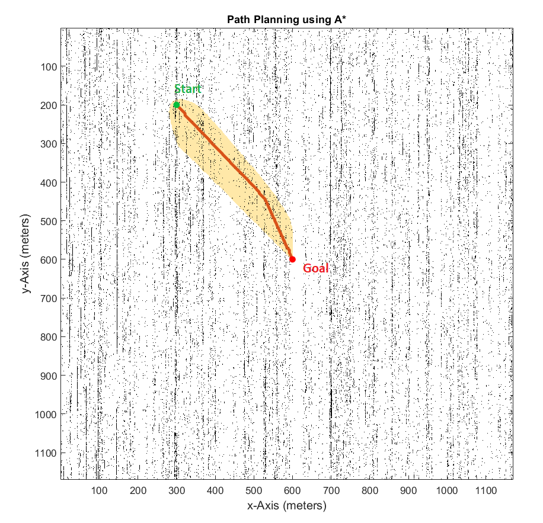

# Path Planning on 3D Terrain using Matlab

## Introduction
The goal of this project is to find the optimal path for a ground robot on a Digital Elevation Model (DEM) with the ability to not move on an elevation of more than 30 degrees. The DEM is captured using flying drones with mounted cameras. These captured images are processed to generate the 3D elevation model.  
First of all, the 3D model is loaded into Matlab workspace using `loadawobj` function. This function returns a struct including vertices, faces, and normals to vertices. The vertex normals are the most important feature to find the elevation at every vertex of the terrain. To find the elevation angle, an angle between vertex normal and horizontal plane normal is computed because this is the same as the angle between terrain face and horizontal axis. After that, angle thresholding is done and a binary occupancy grid map is generated to input to the path planning algorithm which is A* in this case. In the end, the optimal path is plotted on the occupancy grid. 

## Testing
The repository contains the main file named `main.m` which does everything from loading the model to finding the path and displaying that on the occupancy grid. There are many helper functions as well which are called in this main file.  
The figure below shows the path computed by A* on the occupancy gird with 30 degree threshold.

   

Figure below is a zoomed version of path at 20 degrees threshold.

